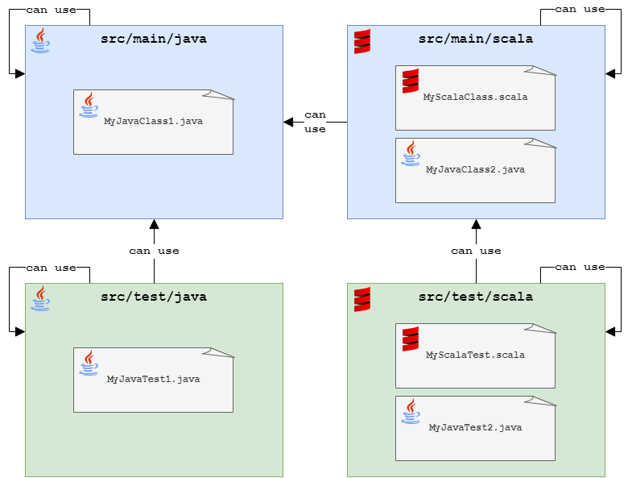

[](https://github.com/rogervinas/scala-java-spring-boot/actions/workflows/gradle.yml)


# Scala in a Java Spring Boot Project

Based on https://github.com/srpraneeth/SpringsScala



## Build & Test

```
./gradlew clean build
```

## Run locally

Run it with:

```
./gradlew bootRun
```

and test it with:

```
curl -i "localhost:8000/hello?name=You"
```
